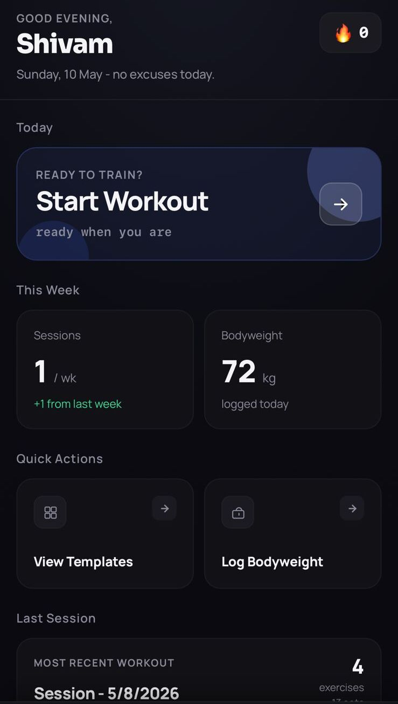
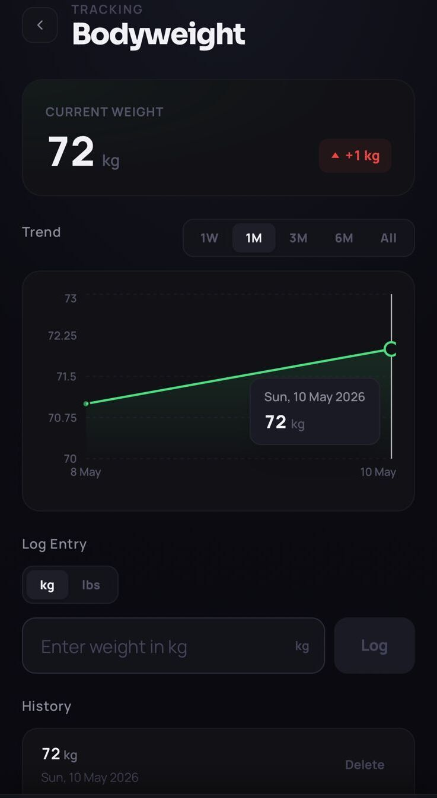

<div align="center">

<br />

# REPUP.

### Every rep counts.

<br />

[](https://repup.cloud)
[](#)

<br />


---


&nbsp;&nbsp;

&nbsp;&nbsp;


</div>

---

## 💭 Why I built this

I train 5–6 days a week and every tracker I tried was either a notes app or a subscription product. I wanted something that felt fast, worked without internet, and handled the actual complexity of how I train - multiple set types, warmups, drop sets, rest timers - without being bloated. So I built it.

RepUp is also the most complete full-stack project I've built: a real auth system, a proper PWA pipeline, a session architecture on the backend, and a frontend that actually works the way it is supposed to.

---

## 🛠️ Built with

| Layer          | Stack                                                                             |
| -------------- | --------------------------------------------------------------------------------- |
| Frontend       | React 19, TypeScript, Vite, Tailwind CSS v4, Zustand, TanStack Query v5, Recharts |
| Backend        | Node.js, Express 5, TypeScript, MongoDB + Mongoose, JWT, Zod, Resend SMTP         |
| Infrastructure | Vercel (client), Render (server), MongoDB Atlas                                   |

---

## ⚡ Features

### Session Tracking

- Full session lifecycle - create, build, log, complete
- Three set types: **Strength** (weight × reps), **Cardio** (duration + distance), **Flexibility** (hold time)
- Set markers for **Warmup `W`**, **Drop Set `D`**, and **Failure `F`**
- Live elapsed timer during active sessions
- Rest timer with haptic feedback on mobile

### Templates & Library

- 130+ exercises across every muscle group, equipment type, and movement category
- 14 built-in templates - Push/Pull/Legs, Upper/Lower, Full Body splits, and more
- Build and save custom templates; search and filter by muscle group or equipment

### Progress Tracking

- Streak counter and weekly session count
- Bodyweight log with an interactive line chart across 1W / 1M / 3M / 6M / All time ranges
- TDEE-based calorie and macro targets set at onboarding

### Auth

- Email registration with OTP verification - no unverified accounts persist
- JWT access + refresh token rotation
- Forgot/reset password via email link
- Full account deletion with complete data wipe

### PWA

- Installs to home screen on iOS and Android like a native app
- Full offline support after first load via service worker
- Safe area insets for notched phones, custom splash screen, and app icons

---

## 📡 API

<details>
<summary><strong>Auth</strong> &nbsp;·&nbsp; <code>/api/v1/auth</code></summary>
<br />

```
POST  /register
POST  /verify-otp
POST  /resend-otp
POST  /login
POST  /logout
POST  /refresh
POST  /forgot-password
POST  /reset-password
```

</details>

<details>
<summary><strong>User</strong> &nbsp;·&nbsp; <code>/api/v1/user</code></summary>
<br />

```
GET    /profile
PATCH  /profile
DELETE /account
POST   /bodyweight
GET    /bodyweight
```

</details>

<details>
<summary><strong>Exercises</strong> &nbsp;·&nbsp; <code>/api/v1/exercises</code></summary>
<br />

```
GET  /
GET  /:id
POST /
```

</details>

<details>
<summary><strong>Templates</strong> &nbsp;·&nbsp; <code>/api/v1/templates</code></summary>
<br />

```
GET    /
POST   /
GET    /:id
PATCH  /:id
DELETE /:id
```

</details>

<details>
<summary><strong>Sessions</strong> &nbsp;·&nbsp; <code>/api/v1/sessions</code></summary>
<br />

```
POST   /create
POST   /:id/add-exercise
POST   /:id/log-set
PATCH  /:id/complete
GET    /
GET    /:id
DELETE /:id
```

</details>

---

## 📁 Project Structure

```
rep-up/
├── screenshots/
├── client/
│   ├── public/              # PWA manifest, icons
│   └── src/
│       ├── pages/           # 13 route pages
│       ├── components/      # shared UI components
│       ├── store/           # Zustand global state
│       ├── hooks/           # React Query data hooks
│       └── lib/             # axios instance, helpers
│
└── server/
    └── src/
        ├── config/          # DB connection
        ├── controllers/
        ├── models/
        ├── routes/
        ├── middleware/      # auth, errorHandler
        └── utils/           # asyncHandler, ApiError, ApiResponse
```

---

MIT License © 2026 [Shivam](https://github.com/shivamm2606)
